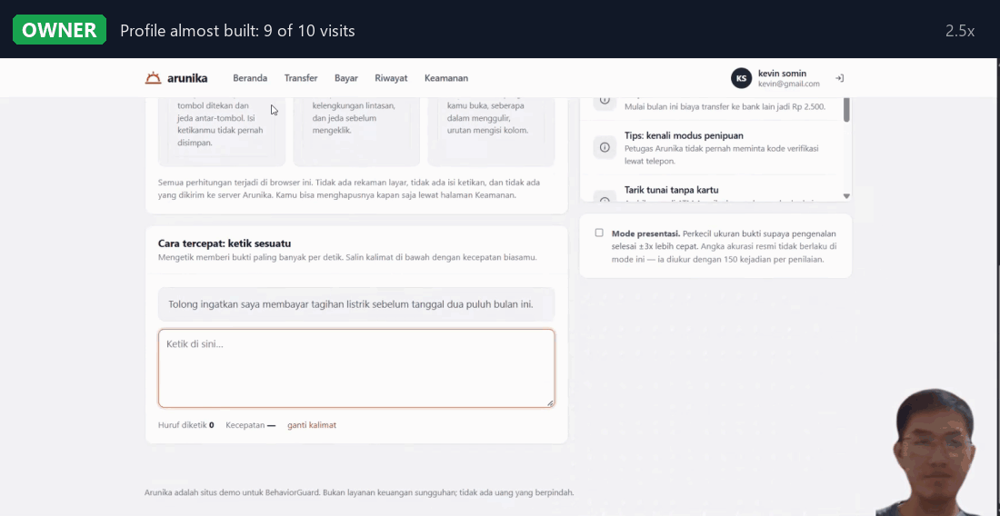

# BehaviorGuard

**Mendeteksi pengambilalihan akun dari cara seseorang menggerakkan mouse, mengetik, dan
berpindah halaman - lalu bertindak di tempat yang menentukan: server Anda sendiri. Satu tag
script di halaman, beberapa baris di backend, lengkap dengan verifikasi tambahan (step-up).**

> English version: [README.md](README.md)

## Demo

Pemilik vs penyusup, akun dan kata sandi yang sama:

<p align="center">
  
</p>

Dipasang ke toko polos yang punya backend sendiri, lalu dibuka dari browser kedua dengan
password curian:

<p align="center">
  
</p>

---

## Masalahnya

Login itu **pemeriksaan di pintu**, bukan **penjaga di dalam**. Password, OTP, sidik
perangkat - semuanya diperiksa sekali saat masuk. Sesudah itu semua dipercaya.

Justru di situ celahnya. Password bocor, cookie sesi dicuri, ekstensi browser jahat,
penipuan remote-access, laptop yang ditinggal terbuka: hasilnya sama - sesi yang **sudah
lolos pintu** tapi kini dipakai orang lain.

**BehaviorGuard membuat sesi itu terus diperiksa, di infrastruktur milik Anda.** Ia
mempelajari cara *pemilik akun ini* memakai komputer - dinamika mouse, ritme ketikan, pola
navigasi - lalu menilai ulang sesi setiap 30 detik. Kalau perilakunya berhenti mirip
pemilik, ia meminta verifikasi: tantangan ritme-ketik bawaan, atau OTP/WebAuthn milik situs
Anda. Keputusan akhir untuk aksi sensitif ada di backend Anda.

Halaman mengirim **34 angka ringkasan per jendela 30 detik** ke server Anda. Event mentah
tidak pernah keluar dari halaman, dan huruf yang diketik tidak pernah dikirim atau disimpan.

---

## Di mana ia berjalan

```
 browser (halaman Anda)                      server Anda (blueprint Flask, atau server/app.py)
 ---------------------------------           ---------------------------------------------------
 tangkap: pointer, tombol, gulir, navigasi   profil & model akun (dari perangkat mana pun)
 34 fitur per jendela 30 detik     ------>   skor, vonis LOW / MEDIUM / HIGH, aturan berturut
 cek bot / integritas (event mentah)         template ritme ketik dan pencocokannya
 dialog verifikasi (Shadow DOM)    <------   verifikasi: ritme, atau OTP ANDA yang dilaporkan
                                             guard.check() sebelum uang berpindah <- route Anda
```

- **Profil milik akun, bukan milik browser.** Penyerang yang login dengan password curian
  dari laptopnya sendiri langsung dinilai terhadap profil pemilik sejak jendela pertama,
  bukan profil kosong.
- **Keputusan yang memindahkan uang dibuat di server Anda.** `guard.check()` di route Anda
  menjawab boleh atau "verifikasi dulu". Skrip di halaman tidak bisa menembusnya, dan tidak
  bisa menjamin verifikasinya sendiri: hanya backend Anda yang melaporkannya (ia yang
  memegang kunci rahasia).
- **Gagal-tertutup.** Tidak ada penilaian segar, backend tak terjangkau, bukti belum cukup:
  jawabannya "verifikasi", tidak pernah "aman".

Yang masih dikerjakan browser, dan alasannya: menghitung 34 angka (supaya perilaku mentah
tetap di halaman) dan menjalankan heuristik bot/integritas, yang butuh aliran event mentah.

Ada juga **mode lokal** - mesin yang sama sepenuhnya di browser, profil di IndexedDB, tanpa
server. Mode itu yang dipakai harness riset dan uji konformansi, dan praktis untuk mencoba
pustaka di halaman statis. Mode lokal tidak bisa melindungi dari penyerang di perangkat lain
(profilnya tidak ada di sana), jadi bukan cara pasang yang dianjurkan.

---

## Pasang (Flask, sekitar 15 baris)

Bagian server ada di `server/` (`guard.py`, `engine.py`, `rhythm.py`, plus `core/bg_core.py`;
salinan datarnya di `dist/server/`). Pustaka standar ditambah Flask, tidak ada yang lain.

```python
from guard import Guard, create_blueprint

guard = Guard('behaviorguard.db', tenant=(BG_PK, BG_SK))          # kunci dari environment
app.register_blueprint(create_blueprint(guard), url_prefix='/bg')  # API untuk browser

@app.get('/api/bg-token')                      # sesudah login: token untuk user INI dan login INI
def bg_token():
    return {'token': guard.mint_token(current_user.id, session['login_id'], ttl=900)}

@app.post('/api/transfer')
def transfer():
    c = guard.check(current_user.id, session['login_id'], money=True)
    if not c['allowed']:
        return {'verify': True, 'reason': c['reason']}, 403      # halaman verifikasi, lalu kirim ulang
    ...                                                          # pindahkan uangnya

# OTP Anda sendiri, dicek oleh Anda, dilaporkan ke guard:
guard.report_verified(None, current_user.id, session['login_id'], passed=True)
```

Halamannya:

```html
<script src="/dist/behaviorguard.min.js" data-endpoint="/bg" data-token-url="/api/bg-token" defer></script>
<script>
  // sebelum aksi sensitif: penilaian segar, disimpan di server untuk guard.check()
  async function sebelumTransfer() {
    const v = await BehaviorGuard.assessNow();     // UNKNOWN = bukti belum cukup -> tetap verifikasi
    if (v.level === 'LOW') return true;
    return (await BehaviorGuard.stepUp({ reason: 'kirim transfer ini' })).verified;
  }
</script>
```

Itu seluruh integrasinya. Penangkapan event, pendaftaran, penilaian, latih ulang, dan popup
verifikasi berjalan sendiri; id pengguna diambil dari token yang ditandatangani, bukan dari
halaman.

**Bukan Flask?** Jalankan `server/app.py` sebagai layanan dan tandatangani tokennya di backend
Anda sendiri (HMAC-SHA256, empat baris di Node, PHP, atau Laravel):
[docs/INTEGRATION.id.md](docs/INTEGRATION.id.md).

Dialog verifikasinya hidup di Shadow DOM (CSS situs tidak bisa merusaknya, CSP ketat aman),
bisa dipakai dengan keyboard & pembaca layar, dan jalan di keyboard layar sentuh. Ritme
ketiknya dicocokkan **di server** terhadap template pemilik.

**Sudah punya OTP / WebAuthn?** Itulah jalur "Gunakan cara lain" di dialog, dan dipakai
otomatis saat pengguna belum punya template irama atau sudah terlalu sering gagal. Server Anda
memeriksa kodenya lalu memanggil `guard.report_verified(...)`; pustaka kemudian mengambil
hasilnya:

```js
window.BehaviorGuardConfig = { mfa: { onFallback: async () => await dialogOtpSaya() } };
```

`BehaviorGuard.status()` memberi keadaan untuk UI Anda sendiri (masih mengenali / melindungi,
progres pendaftaran, vonis terakhir), `stop()` untuk logout, `forget()` menghapus profil akun
(sesudah verifikasi segar).

Untuk produksi, pakai `dist/behaviorguard.min.js` (155 KB, **47 KB gzip**): bundel yang sama
tanpa baris komentar dan indentasi; `node tools/min_check.mjs` membuktikan urutan vonisnya
identik.

Panduan lengkap: [docs/QUICKSTART.md](docs/QUICKSTART.md). Panduan pasang:
[dist/INSTALL.md](dist/INSTALL.md).

---

## Yang terlihat

```
sesi 1-10      pendaftaran     belum ada vonis - model sedang mengenal pemilik
sesi 11+       LOW             ALLOW_SESSION
               MEDIUM          REQUIRE_MFA       -> minta verifikasi
               HIGH            REQUIRE_STEPUP    -> minta verifikasi
               HIGH 2x         BLOCK_SESSION     -> berturut-turut, bukan sekadar hari yang beda
               UNKNOWN         ABSTAIN           -> bukti belum cukup (TIDAK berarti aman)
```

Satu vonis butuh 150 event bukti. Sesudah pemilik lolos verifikasi, vonis MEDIUM tidak
bertanya lagi selama 15 menit (HIGH tetap bertanya, dan meninggalkan kursi 5 menit
membatalkannya).

---

## Hasil

Diukur pada **653 sesi dari 16 relawan** dengan menjalankan **pustaka yang dikirim itu
sendiri** (`node research/eval_sdk.mjs --live`): tiap sesi riset diputar ulang lewat jalur
asli dari penangkapan sampai vonis, per jendela 30 detik persis seperti di browser. Sesi
diputar **menurut urutan rekamannya**, satu kunjungan per sesi (muat halaman, status dibaca
ulang dari penyimpanan), jadi pendaftaran = sepuluh kunjungan pertama tiap pemilik. Pemilik
menjawab verifikasi lewat API publik `reportStepUp`. Penyusup = 15 relawan lain, masing-masing
datang lewat kunjungan baru ke akun pemilik. Harness menjalankan pustaka dalam mode lokal;
mesin server (`server/engine.py`) dicocokkan dengannya keputusan demi keputusan
(`python server/test_parity.py`: level, aksi, skor, ambang, dan model yang sama di setiap
jendela), jadi angka ini juga angka mode backend.

| Pemilik | |
| --- | --- |
| Vonis yang meminta pemilik verifikasi | **11,4%** |
| ... di seperlima akhir riwayat tiap pemilik | 7,2% |
| Pemilik diblokir | **0%** |

| Penyusup (password curian, perangkat sendiri) | di jamnya sendiri | di jam biasa pemilik |
| --- | ---: | ---: |
| Lolos vonis pertama tanpa gangguan | **10,5%** | 14,3% |
| Lolos **seluruh** sesinya tanpa gangguan | **7,9%** | 10,8% |
| Tidak pernah dinilai (sesinya terlalu pendek) | 0,6% | 0,6% |

| Ambil-alih (penyusup terus memakai akun, 6 sesi) | |
| --- | --- |
| Ketahuan di sesi pertama | **95,0%** |
| Ketahuan dalam 3 sesi | 99,6% |
| Tidak pernah ketahuan dalam 6 sesi | **0,4%** (1 dari 240 pasangan) |

Daya pisah tanpa ambang, per pemilik: AUC **0,953**, EER **10,1%**.

Kolom kanan penyusup = penyerang yang lebih pintar, login di jam yang sama dengan kebiasaan
pemilik (`--same-hour`). Tiap relawan merekam di blok jam yang khas, jadi fitur jam-dalam-hari
ikut menangkap sebagian penyusup di kolom kiri dengan gratis; kolom kanan membuang bantuan itu.

### Memilih titik operasi

Satu knob: `init({ calibration: { k_low } })`. Makin kecil makin ketat.

| `k_low` | pemilik diminta verifikasi | penyusup lolos vonis-1 | penyusup lolos seluruh sesi | ambil-alih tak ketahuan |
| --- | ---: | ---: | ---: | ---: |
| 1,25 | 17,0% | 6,5% | 4,8% | 0,4% |
| 1,5 | 14,8% | 8,6% | 6,5% | 0,4% |
| **1,75 (default)** | **11,4%** | **10,5%** | **7,9%** | **0,4%** |
| 2,0 | 10,0% | 12,3% | 9,4% | 0,4% |
| 2,5 | 7,7% | 16,6% | 12,9% | 0,4% |

Default dipilih di 8 subjek dan diperiksa di 8 subjek lain (C-33). Di 8 subjek uji itu saja,
default memberi gesekan pemilik 12,7% dan penyusup lolos vonis pertama 9,2%.

**Mode ketat (opt-in):** `session: { contextEvents: 450 }` - vonis berikutnya dalam satu
kunjungan ikut memakai bukti yang baru dinilai.

| mode ketat | pemilik diminta verifikasi | penyusup lolos vonis-1 | seluruh sesi | ambil-alih tak ketahuan |
| --- | ---: | ---: | ---: | ---: |
| `contextEvents: 450` | 12,5% | 7,0% | 6,3% | 0% |
| `contextEvents: 450`, `k_low: 2.0` | 11,0% | 8,7% | 7,9% | 0% |

Baris kedua mengalahkan default di semua kolom ini, tapi pada varian data AFK (pengguna yang
meninggalkan layar di tengah sesi) penyusup lolos seluruh sesi 6,5% alih-alih 5,6%, jadi
tidak dijadikan default. Lihat [core/DRIFT.md](core/DRIFT.md) C-42 dan C-44.

### Membaca angka ini dengan jujur

- **Sekitar 1 dari 10 penyusup lolos pemeriksaan pertama** (1 dari 7 bila login di jam biasa
  pemilik). Ini lapisan verifikasi tambahan,
  bukan gembok. HIGH artinya "suruh buktikan", bukan bukti penipuan. Aksi sensitif wajib
  `assessNow()`.
- **Penyusupnya 15 pengguna biasa, bukan penyerang yang sengaja meniru korban.** Peniruan
  terarah **belum diuji** - lihat [THREAT-MODEL.md](THREAT-MODEL.md).
- **Gesekan pemilik bukan derau acak.** Ia rata di semua jendela dalam satu kunjungan:
  pemilik ditandai pada *hari* ketika perilakunya memang beda, di semua jendela hari itu.
  Itu tidak bisa dirata-rata; itulah tugas verifikasi tambahan - dan karena itu lolos
  verifikasi kini memberi 15 menit tenang. Gesekan itu juga turun seiring model belajar dari
  verifikasi tersebut: 10,0% di seperlima awal riwayat pemilik, 16,2% di tengah, 7,2% di akhir.
- **16 relawan itu sampel kecil.** Di populasi dan situs lain angka bisa bergeser beberapa
  poin.
- **Angka lama di repo ini mengukur mesin lain.** FRR 16,1% / FAR 5,4% berasal dari harness
  Python yang menilai sesi riset utuh (~700 event), satuan yang tak pernah dinilai pustaka;
  FRR 35,1% / FAR 0,9% berasal dari One-Class SVM scikit-learn yang tidak dikirim. Tabel di
  atas adalah pengukuran pertama atas pustaka yang benar-benar dipakai
  ([core/DRIFT.md](core/DRIFT.md) C-27, C-29).

### Data dan reproduksi

- **Datanya.** 16 relawan, 653 sesi, direkam dalam skenario berbasis tugas (menjelajah,
  mencari, mengisi formulir, checkout). Sesinya padat dan jarang ada jeda panjang, beda dengan
  pemakaian nyata; karena itu ada penanganan idle
  ([research/notes/CONTEXT-AND-IDLE-PROPOSAL.md](research/notes/CONTEXT-AND-IDLE-PROPOSAL.md)).
- **Tidak dipublikasikan.** Setiap relawan setuju data interaksinya dipakai untuk riset ini.
  Data itu biometrik perilaku orang sungguhan, jadi tidak masuk repo ini:
  `research/export_sessions.py` menulis ke direktori sementara OS, tidak pernah ke repo.
- **Ukur dengan data sendiri.** `research/eval_sdk.mjs` membaca satu berkas JSON,
  `{"subjects": {"<id>": [[event, ...], ...]}}`, sesi urut waktu rekam, event dengan format
  capture di [core/SPEC.md](core/SPEC.md) bagian 8 (isi `BehaviorGuard._instance.capture.peek()`).
  Minimal 11 sesi per subjek (10 untuk pendaftaran) dan dua subjek atau lebih:

  ```bash
  node research/eval_sdk.mjs --data sesi_saya.json --live
  node research/eval_sdk.mjs --data sesi_saya.json --live --same-hour
  ```

---

## Satu otak, lima bahasa

| Runtime | Jangkauan | Konformansi |
| --- | --- | --- |
| JavaScript | browser, Node, edge | 319/319 |
| Python | server, data, ML | 319/319 |
| Rust | sistem, CLI, embedded | 319/319 |
| Java | JVM, **Android**, Kotlin | 319/319 |
| WASM | host WASM mana pun | 319/319 |

Algoritmanya ditulis sebagai spesifikasi yang lepas dari bahasa ([core/SPEC.md](core/SPEC.md)
v1.4.0), dan setiap implementasi dicek terhadap [core/golden.json](core/golden.json) yang
sama: 319 pemeriksaan, toleransi 1e-9. Nol dependensi di semua bahasa. Mesin server berdiri
di atas inti Python (`core/bg_core.py`), dan lapisan keputusannya dicocokkan dengan pustaka
JavaScript jendela demi jendela (`server/test_parity.py`).

---

## Coba demonya

```bash
pip install flask
python demo/arunika/server.py        # http://127.0.0.1:8300   (--lan supaya bisa dibuka dari laptop kedua)
```

**Arunika, bank realistis dengan BehaviorGuard di backend-nya** ([demo/arunika](demo/arunika/)).
Akun, saldo, dan riwayat ada di server Flask-nya sendiri; API BehaviorGuard dipasang di
dalamnya, transfer/pembayaran/ganti sandi bertanya ke `guard.check()` dulu, dan kode sekali
pakainya (dikirim ke HP simulasi) dilaporkan lewat `guard.report_verified()`. Demo dimulai dari
pembukaan akun: profil dibangun dari nol sambil ditonton. Lalu buka akun yang sama dari
**laptop kedua** dengan passwordnya: laptop itu langsung dinilai terhadap profil pemilik,
perilaku orang asing = HIGH, dan server mengakhiri login tersebut.

**Pasang di toko polos (GIF di atas):** [demo/shop-checkout](demo/shop-checkout/) - toko Flask
dengan backend sendiri, tanpa MFA. Satu baris di backend, satu di halaman; README di sana
menjelaskan langkahnya.

```bash
python demo/shop-checkout/shop.py    # http://127.0.0.1:5000
```

**Mode lokal, tanpa server:** `python -m http.server 8080`, lalu
<http://localhost:8080/research/legacy-demos/monitor/> (toko tanpa satu baris kode BehaviorGuard
pun, dinilai dari luar) dan tiga toko plug-and-play di
[research/legacy-demos/](research/legacy-demos/README.md).

```bash
python core/conformance.py           # mesin vs golden.json              -> 319/319
node   core/lifecycle.test.mjs       # siklus hidup & API integrator     -> 49/49
node   core/stepup.test.mjs          # verifikasi, cadangan, penguncian  -> 61/61
node   core/privacy.test.mjs         # huruf ketikan tidak tersimpan     -> 14/14
python server/test_app.py            # API server: token, gerbang, IDOR  -> 61/61
python server/test_parity.py         # mesin server == pustaka JS        -> 67 jendela
python server/test_backend_sdk.py    # pustaka lewat HTTP vs server      -> 21/21
python demo/arunika/test_server.py   # backend bank demo                 -> 38/38
```

---

## Cara kerja singkat

```
event DOM -> buang kembar -> pendekkan jeda idle -> kumpulkan 150 event
         -> 34 fitur -> z-score vs pemilik -> IF 0,30 + Mahalanobis 0,70
         -> ambang per pemilik (mean - k*std) -> LOW / MEDIUM / HIGH + alasan
         -> cek rekam-ulang, lantai lengket, aturan HIGH berturut, absen, masa berlaku
         -> verifikasi (ritme ketik bawaan, atau OTP Anda lewat guard.report_verified)
         -> guard.check() di route Anda sebelum aksi sensitif
```

Dua baris pertama berjalan di halaman; semuanya mulai dari z-score berjalan di server Anda.

- **Pendaftaran** - 10 sesi layak pertama menjadi jangkar profil pemilik dan tidak pernah
  tergeser.
- **Hanya belajar dari yang tepercaya** - hanya jendela LOW atau yang lolos verifikasi yang
  boleh melatih model, supaya penyusup tidak bisa pelan-pelan "mengajari" sistem.
- **AFK** - jeda >= 15 detik dipendekkan, bukan dipotong. Absen 5 menit mereset
  kepercayaan; 15 menit meminta verifikasi ulang (serangan jam makan siang).
- **Rekam-ulang** - sesi yang hampir identik dengan sesi tersimpan divonis HIGH.

Detail: [ARCHITECTURE.md](ARCHITECTURE.md).

---

## Privasi

Event mentah tidak pernah keluar dari halaman, dan huruf yang diketik tidak pernah dikirim
atau disimpan di mana pun. Per jendela 30 detik halaman mengirim 34 angka fitur, berapa event
dan detik asalnya, dan hasil cek bot. Server Anda menyimpan per akun: vektor-vektor itu (kolam
latih), vonis, dan template ritme ketik (lama tekan dan jeda antartombol untuk satu frasa,
bukan hurufnya). Tidak ada telemetri dan tidak ada pihak ketiga: servernya milik Anda.

`forget()` menghapus profil dan template akun (sesudah verifikasi segar, supaya penyusup di
dalam sesi tidak bisa menghapus profil pemilik lalu dipelajari sebagai pemilik); backend Anda
bisa memanggil `guard.forget(..., require_verified=False)` saat akun dihapus.

---

## Dokumentasi

| Dokumen | Isi |
| --- | --- |
| [docs/QUICKSTART.md](docs/QUICKSTART.md) | Semua cara integrasi dan konfigurasi |
| [docs/INTEGRATION.id.md](docs/INTEGRATION.id.md) | Backend Anda di Flask, Node, PHP, atau Laravel: token, gerbang, laporan OTP |
| [server/README.md](server/README.md) | Server: kunci, token pengguna, endpoint, gerbang, dashboard |
| [dist/INSTALL.md](dist/INSTALL.md) | Panduan pasang satu tag (bahasa Inggris) |
| [ARCHITECTURE.md](ARCHITECTURE.md) | Pipeline, peta modul, keputusan desain |
| [THREAT-MODEL.md](THREAT-MODEL.md) | Batas kepercayaan, serangan yang belum tertutup |
| [core/DRIFT.md](core/DRIFT.md) | Audit C-1..C-49: tiap cacat, buktinya, dan ujinya |
| [core/SPEC.id.md](core/SPEC.id.md) | Spesifikasi mesin |

---

## Lisensi

MIT - lihat [LICENSE](LICENSE).
