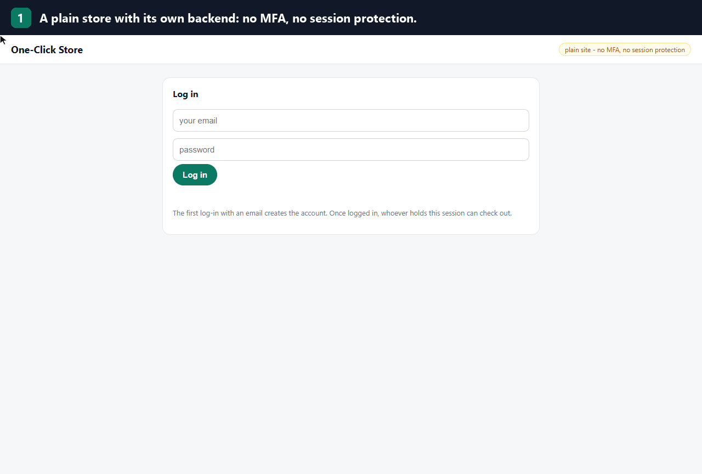

# BehaviorGuard

**Mendeteksi pengambilalihan akun dari cara seseorang menggerakkan mouse, mengetik, dan
berpindah halaman - seluruhnya di perangkat pengguna, lengkap dengan verifikasi tambahan
(step-up). Satu tag script. Tanpa backend.**

> English version: [README.md](README.md)

## Demo

<p align="center">
  
</p>

---

## Masalahnya

Login itu **pemeriksaan di pintu**, bukan **penjaga di dalam**. Password, OTP, sidik
perangkat - semuanya diperiksa sekali saat masuk. Sesudah itu semua dipercaya.

Justru di situ celahnya. Password bocor, cookie sesi dicuri, ekstensi browser jahat,
penipuan remote-access, laptop yang ditinggal terbuka: hasilnya sama - sesi yang **sudah
lolos pintu** tapi kini dipakai orang lain.

**BehaviorGuard membuat sesi itu terus diperiksa.** Ia mempelajari cara *pemilik akun ini*
memakai komputer - dinamika mouse, ritme ketikan, pola navigasi - lalu menilai ulang sesi
setiap 30 detik. Kalau perilakunya berhenti mirip pemilik, ia meminta verifikasi: tantangan
ritme-ketik bawaan, atau OTP/WebAuthn milik situs Anda.

Data interaksi mentah tidak pernah keluar dari browser. Huruf yang diketik tidak pernah
disimpan, bahkan di perangkat itu sendiri.

---

## Pasang dalam 30 detik

```html
<script src="dist/behaviorguard.js" data-user="andi@contoh.id" defer></script>
<script>
  addEventListener('behaviorguard:risk', e => {
    // e.detail = { level, score, action, reasons, topFeatures, ... }
    if (e.detail.level === 'HIGH') kunciCheckout();
  });
</script>
```

Itu seluruh integrasinya. Penangkapan event, penilaian, pendaftaran, latih ulang, dan popup
verifikasi berjalan sendiri.

Dialog verifikasinya hidup di Shadow DOM (CSS situs tidak bisa merusaknya, CSP ketat aman),
bisa dipakai dengan keyboard & pembaca layar, dan jalan di keyboard layar sentuh.

**Sudah punya OTP / WebAuthn?** Pasang sebagai jalur "Gunakan cara lain" di dialog. Jalur ini
juga dipakai otomatis saat pengguna belum punya template irama atau sudah terlalu sering gagal:

```js
window.BehaviorGuardConfig = { userId, mfa: { onFallback: async () => await otpDiverifikasiServer() } };
```

Atau matikan dialog bawaan dan laporkan hasil verifikasi Anda dengan
`BehaviorGuard.reportStepUp({ passed: true })`.

**Sebelum aksi sensitif** (ganti email/sandi, transfer, tambah perangkat), minta vonis saat
itu juga, lalu verifikasi bila perlu:

```js
const v = BehaviorGuard.assessNow();   // UNKNOWN = bukti belum cukup -> tetap minta verifikasi
if (v.level !== 'LOW' && !(await BehaviorGuard.stepUp({ reason: 'ganti email' })).verified) return;
```

`BehaviorGuard.status()` memberi keadaan untuk UI Anda sendiri (masih mengenali / melindungi,
progres pendaftaran, vonis terakhir), `stop()` untuk logout, `forget()` menghapus data pengguna.

Untuk produksi, pakai `dist/behaviorguard.min.js` (118 KB, **37 KB gzip**): bundel yang sama
tanpa baris komentar dan indentasi; `node tools/min_check.mjs` membuktikan urutan vonisnya
identik.

Panduan lengkap (modul ES, objek konfigurasi, server opsional):
[docs/QUICKSTART.md](docs/QUICKSTART.md). Panduan pasang berbahasa Indonesia:
[dist/INSTALL.md](dist/INSTALL.md).

---

## Yang terlihat

```
sesi 1-10      pendaftaran     belum ada vonis - model sedang mengenal pemilik
sesi 11+       LOW             ALLOW_SESSION
               MEDIUM          REQUIRE_MFA       -> minta verifikasi
               HIGH            REQUIRE_STEPUP    -> minta verifikasi
               HIGH 2x         BLOCK_SESSION     -> berturut-turut, bukan sekadar hari yang beda
               UNKNOWN         ABSTAIN           -> bukti belum cukup (TIDAK berarti aman)
```

Satu vonis butuh 150 event bukti. Sesudah pemilik lolos verifikasi, vonis MEDIUM tidak
bertanya lagi selama 15 menit (HIGH tetap bertanya, dan meninggalkan kursi 5 menit
membatalkannya).

---

## Hasil

Diukur pada **653 sesi dari 16 relawan** dengan menjalankan **pustaka yang dikirim itu
sendiri** (`node tools/eval_sdk.mjs --live`): tiap sesi riset diputar ulang lewat jalur
asli dari penangkapan sampai vonis, per jendela 30 detik persis seperti di browser. Sesi
diputar **menurut urutan rekamannya**, satu kunjungan per sesi (muat halaman, status dibaca
ulang dari penyimpanan), jadi pendaftaran = sepuluh kunjungan pertama tiap pemilik. Pemilik
menjawab verifikasi lewat API publik `reportStepUp`. Penyusup = 15 relawan lain, masing-masing
datang lewat kunjungan baru ke akun pemilik.

| Pemilik | |
| --- | --- |
| Vonis yang meminta pemilik verifikasi | **11,4%** |
| ... di seperlima akhir riwayat tiap pemilik | 7,2% |
| Pemilik diblokir | **0%** |

| Penyusup (password curian, perangkat sendiri) | di jamnya sendiri | di jam biasa pemilik |
| --- | ---: | ---: |
| Lolos vonis pertama tanpa gangguan | **10,5%** | 14,3% |
| Lolos **seluruh** sesinya tanpa gangguan | **7,9%** | 10,8% |
| Tidak pernah dinilai (sesinya terlalu pendek) | 0,6% | 0,6% |

| Ambil-alih (penyusup terus memakai akun, 6 sesi) | |
| --- | --- |
| Ketahuan di sesi pertama | **95,0%** |
| Ketahuan dalam 3 sesi | 99,6% |
| Tidak pernah ketahuan dalam 6 sesi | **0,4%** (1 dari 240 pasangan) |

Daya pisah tanpa ambang, per pemilik: AUC **0,953**, EER **10,1%**.

Kolom kanan penyusup = penyerang yang lebih pintar, login di jam yang sama dengan kebiasaan
pemilik (`--same-hour`). Tiap relawan merekam di blok jam yang khas, jadi fitur jam-dalam-hari
ikut menangkap sebagian penyusup di kolom kiri dengan gratis; kolom kanan membuang bantuan itu.

### Memilih titik operasi

Satu knob: `init({ calibration: { k_low } })`. Makin kecil makin ketat.

| `k_low` | pemilik diminta verifikasi | penyusup lolos vonis-1 | penyusup lolos seluruh sesi | ambil-alih tak ketahuan |
| --- | ---: | ---: | ---: | ---: |
| 1,25 | 17,0% | 6,5% | 4,8% | 0,4% |
| 1,5 | 14,8% | 8,6% | 6,5% | 0,4% |
| **1,75 (default)** | **11,4%** | **10,5%** | **7,9%** | **0,4%** |
| 2,0 | 10,0% | 12,3% | 9,4% | 0,4% |
| 2,5 | 7,7% | 16,6% | 12,9% | 0,4% |

Default dipilih di 8 subjek dan diperiksa di 8 subjek lain (C-33). Di 8 subjek uji itu saja,
default memberi gesekan pemilik 12,7% dan penyusup lolos vonis pertama 9,2%.

**Mode ketat (opt-in):** `session: { contextEvents: 450 }` - vonis berikutnya dalam satu
kunjungan ikut memakai bukti yang baru dinilai.

| mode ketat | pemilik diminta verifikasi | penyusup lolos vonis-1 | seluruh sesi | ambil-alih tak ketahuan |
| --- | ---: | ---: | ---: | ---: |
| `contextEvents: 450` | 12,5% | 7,0% | 6,3% | 0% |
| `contextEvents: 450`, `k_low: 2.0` | 11,0% | 8,7% | 7,9% | 0% |

Baris kedua mengalahkan default di semua kolom ini, tapi pada varian data AFK (pengguna yang
meninggalkan layar di tengah sesi) penyusup lolos seluruh sesi 6,5% alih-alih 5,6%, jadi
tidak dijadikan default. Lihat [core/DRIFT.md](core/DRIFT.md) C-42 dan C-44.

### Membaca angka ini dengan jujur

- **Sekitar 1 dari 10 penyusup lolos pemeriksaan pertama** (1 dari 7 bila login di jam biasa
  pemilik). Ini lapisan verifikasi tambahan,
  bukan gembok. HIGH artinya "suruh buktikan", bukan bukti penipuan. Aksi sensitif wajib
  `assessNow()`.
- **Penyusupnya 15 pengguna biasa, bukan penyerang yang sengaja meniru korban.** Peniruan
  terarah **belum diuji** - lihat [THREAT-MODEL.md](THREAT-MODEL.md).
- **Gesekan pemilik bukan derau acak.** Ia rata di semua jendela dalam satu kunjungan:
  pemilik ditandai pada *hari* ketika perilakunya memang beda, di semua jendela hari itu.
  Itu tidak bisa dirata-rata; itulah tugas verifikasi tambahan - dan karena itu lolos
  verifikasi kini memberi 15 menit tenang. Gesekan itu juga turun seiring model belajar dari
  verifikasi tersebut: 10,0% di seperlima awal riwayat pemilik, 16,2% di tengah, 7,2% di akhir.
- **16 relawan itu sampel kecil.** Di populasi dan situs lain angka bisa bergeser beberapa
  poin.
- **Angka lama di repo ini mengukur mesin lain.** FRR 16,1% / FAR 5,4% berasal dari harness
  Python yang menilai sesi riset utuh (~700 event), satuan yang tak pernah dinilai pustaka;
  FRR 35,1% / FAR 0,9% berasal dari One-Class SVM scikit-learn yang tidak dikirim. Tabel di
  atas adalah pengukuran pertama atas pustaka yang benar-benar dipakai
  ([core/DRIFT.md](core/DRIFT.md) C-27, C-29).

---

## Satu otak, lima bahasa

| Runtime | Jangkauan | Konformansi |
| --- | --- | --- |
| JavaScript | browser, Node, edge | 319/319 |
| Python | server, data, ML | 319/319 |
| Rust | sistem, CLI, embedded | 319/319 |
| Java | JVM, **Android**, Kotlin | 319/319 |
| WASM | host WASM mana pun | 319/319 |

Algoritmanya ditulis sebagai spesifikasi yang lepas dari bahasa ([core/SPEC.md](core/SPEC.md)
v1.3.0), dan setiap implementasi dicek terhadap [core/golden.json](core/golden.json) yang
sama: 319 pemeriksaan, toleransi 1e-9. Nol dependensi di semua bahasa.

---

## Coba demonya

**Colok ke situs polos (GIF di atas):** [demo/toko-checkout](demo/toko-checkout/) - toko Flask
dengan backend sendiri, tanpa MFA. Dua baris yang dikomentari menyalakan BehaviorGuard;
README di sana menjelaskan langkahnya.

```bash
python -m http.server 8080
```

**Situs realistis yang sudah memasang pustaka:** <http://localhost:8080/demo/arunika/> - bank
digital fiktif (masuk, transfer, bayar tagihan, riwayat, keamanan). Semua kode khusus
BehaviorGuard ada di satu berkas, `demo/arunika/assets/bg-integrasi.js`. Panel presentasi di
pojok kiri bawah menampilkan fase, bukti, vonis, dan alasannya dalam bahasa biasa, serta bisa
mensimulasikan kembali-setelah-absen, rekam-ulang, dan bot.

Tampilan tanpa kode: <http://localhost:8080/demo/pemantau/>. Panel kiri adalah toko biasa **tanpa satu baris
kode BehaviorGuard pun**; panel kanan menempel dari luar dan menampilkan skor langsung.
Panduan lengkap: [demo/README.md](demo/README.md).

```bash
python core/conformance.py         # mesin vs golden.json            -> 319/319
node   core/lifecycle.test.mjs     # siklus hidup & API integrator   -> 49/49
node   core/stepup.test.mjs        # verifikasi, cadangan, penguncian -> 61/61
node   core/privacy.test.mjs       # huruf ketikan tidak tersimpan   -> 14/14
python server/test_app.py          # server opsional: auth, XSS      -> 35/35
node   tools/eval_sdk.mjs --live   # ukur pustaka yang dikirim (butuh ekspor data riset lokal)
```

---

## Cara kerja singkat

```
event DOM -> buang kembar -> pendekkan jeda idle -> kumpulkan 150 event
         -> 34 fitur -> z-score vs pemilik -> IF 0,30 + Mahalanobis 0,70
         -> ambang per pemilik (mean - k*std) -> LOW / MEDIUM / HIGH + alasan
         -> cek rekam-ulang, lantai lengket, aturan HIGH berturut, absen, masa berlaku
         -> verifikasi (ritme ketik bawaan, atau OTP Anda lewat reportStepUp)
```

- **Pendaftaran** - 10 sesi layak pertama menjadi jangkar profil pemilik dan tidak pernah
  tergeser.
- **Hanya belajar dari yang tepercaya** - hanya jendela LOW atau yang lolos verifikasi yang
  boleh melatih model, supaya penyusup tidak bisa pelan-pelan "mengajari" sistem.
- **AFK** - jeda >= 15 detik dipendekkan, bukan dipotong. Absen 5 menit mereset
  kepercayaan; 15 menit meminta verifikasi ulang (serangan jam makan siang).
- **Rekam-ulang** - sesi yang hampir identik dengan sesi tersimpan divonis HIGH.

Detail: [ARCHITECTURE.md](ARCHITECTURE.md).

---

## Privasi

Event mentah tidak pernah keluar perangkat, dan huruf yang diketik tidak pernah disimpan.
Profil disimpan lokal (IndexedDB -> localStorage -> memori). Tidak ada telemetri.

Server opsional ([server/README.md](server/README.md)) hanya menerima **34 angka fitur per
jendela** + vonis, dan hanya aktif kalau Anda memberi kunci publik, endpoint, **dan** token
pengguna berumur pendek yang dicetak backend Anda sendiri.

---

## Dokumentasi

| Dokumen | Isi |
| --- | --- |
| [docs/QUICKSTART.md](docs/QUICKSTART.md) | Semua cara integrasi dan konfigurasi |
| [dist/INSTALL.md](dist/INSTALL.md) | Panduan pasang satu tag (bahasa Inggris) |
| [ARCHITECTURE.md](ARCHITECTURE.md) | Pipeline, peta modul, keputusan desain |
| [THREAT-MODEL.md](THREAT-MODEL.md) | Batas kepercayaan, serangan yang belum tertutup |
| [core/DRIFT.md](core/DRIFT.md) | Audit C-1..C-45: tiap cacat, buktinya, dan ujinya |
| [core/SPEC.id.md](core/SPEC.id.md) | Spesifikasi mesin |

---

## Lisensi

MIT - lihat [LICENSE](LICENSE).
