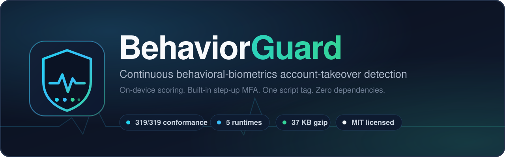

<p align="center">
  
</p>

# BehaviorGuard

**Detect account takeover from how someone moves, types and navigates - entirely on the
device, with a built-in step-up challenge. One script tag. No backend required.**

[](core/golden.json)
[](LICENSE)
[](#no-dependencies-anywhere)

> Versi bahasa Indonesia: [README.id.md](README.id.md)

---

## The problem

Authentication is a **door check**, not a **guard**. Almost every control fires once, at
login: password, OTP, device fingerprint. Everything after that is trusted.

That is exactly the window attackers use. Credential stuffing, session-cookie theft,
malicious browser extensions, remote-access scams and physical device handoff all produce
the same thing - a session that **passed the door check** and is now driven by someone
else. The login was legitimate. The session is not.

The usual answer is a server-side risk engine: it sees IP, user agent and coarse behavior,
it requires a backend, and it ships your users' interaction data off-device. For a small
team, a research project, or a privacy-sensitive product, that is a heavy and often
unacceptable price.

**BehaviorGuard makes the session itself continuously accountable.** It builds a model of
how *this account's owner* behaves - mouse dynamics, keystroke rhythm, navigation shape -
and re-scores the live session every 30 seconds. When the behavior stops looking like the
owner, it asks for a step-up: its own typing-rhythm challenge, or your OTP / WebAuthn.

Raw interaction data never leaves the browser. The characters a user types are never
stored - not even on the device.

---

## 30-second quickstart

One tag. No build step, no bundler, no account, no API key.

```html
<script src="dist/behaviorguard.js" data-user="andi@example.com" defer></script>
<script>
  addEventListener('behaviorguard:risk', e => {
    // e.detail = { level, score, action, reasons, topFeatures, ... }
    if (e.detail.level === 'HIGH') lockCheckout();
  });
</script>
```

That is the whole integration. Capture (pointer, keystroke, scroll, focus, navigation),
scoring, enrollment, retraining and the step-up prompt all start on their own.

**The built-in step-up needs no code at all.** On a `MEDIUM` or `HIGH` verdict the library
raises its own dialog and asks the user to retype a short phrase; identity is proven from
per-character dwell and flight timing. The dialog lives in a Shadow DOM (site CSS cannot
break it, strict CSP is fine), is accessible, and works with touch-screen keyboards.

**Already have OTP or WebAuthn?** Plug it in as the dialog's "use another method" path. It is
also used automatically when the user has no rhythm template yet or has failed too often:

```js
window.BehaviorGuardConfig = { userId, mfa: { onFallback: async () => await myServerVerifiedOtp() } };
```

Or turn the built-in dialog off and report your own result with
`BehaviorGuard.reportStepUp({ passed: true })`.

**Before a sensitive action** (change email or password, payout, new device), ask for a
verdict right now instead of waiting for the next 30-second window, and step up if needed:

```js
const v = BehaviorGuard.assessNow();             // UNKNOWN means "not enough evidence": fail closed
if (v.level !== 'LOW' && !(await BehaviorGuard.stepUp({ reason: 'change your email' })).verified) return;
```

`BehaviorGuard.status()` gives you what to show in your own UI (learning vs protecting,
enrollment progress, last verdict), `stop()` is logout, `forget()` erases the user's data.

For production, serve `dist/behaviorguard.min.js` (118 KB, **37 KB gzip**). It is the same
bundle with whole-line comments and indentation removed, and `node tools/min_check.mjs`
proves it returns the identical verdict sequence.

More: [docs/QUICKSTART.md](docs/QUICKSTART.md) covers the ES-module form, the config
object, the optional server and framework notes.

---

## What you actually see

```
sessions 1-10    enrollment       no verdicts yet - the model is learning the owner
session 11+      LOW              ALLOW_SESSION
                 MEDIUM           REQUIRE_MFA       -> step-up prompt
                 HIGH             REQUIRE_STEPUP    -> step-up prompt
                 HIGH twice       BLOCK_SESSION     -> run rule: sustained, not a bad day
                 UNKNOWN          ABSTAIN           -> not enough evidence yet (never "safe")
```

A verdict needs 150 events of evidence; the window still ticks every 30 seconds and
collects evidence until it has enough. After the owner passes a step-up, `MEDIUM` verdicts
do not ask again for 15 minutes (`HIGH` always does, and walking away for 5 minutes
cancels it).

Every verdict carries its reasoning - the top deviating features with their z-scores - so
`HIGH` is never a black box:

```js
{ level: 'HIGH', score: -4.21, action: 'REQUIRE_STEPUP',
  reasons: ['keystroke_dwell_time_mean z=-3.90', 'mouse_velocity_std z=3.12'],
  modelLevel: 'HIGH', modelScore: -4.21, stickyFloor: false, consecutiveHigh: 1 }
```

---

## Results

Measured on **653 sessions from 16 human subjects** by driving the **shipped library
itself** (`node tools/eval_sdk.mjs --live`): every session is replayed through the real
capture-to-verdict path in 30-second windows, exactly as `setInterval` runs in a browser.
Sessions are replayed **in the order they were recorded**, one visit each (page load, state
read back from storage), so enrollment is each owner's first ten visits. Owners answer
step-ups through the public `reportStepUp` API. Impostors are the other 15 subjects, each
arriving through a fresh visit on the owner's account.

| Owner | |
| --- | --- |
| Verdicts that asked the owner to verify | **11.4%** |
| ... in the last fifth of each owner's history | 7.2% |
| Owner blocked | **0%** |

| Impostor (stolen password, own device) | at their own hour | at the owner's usual hour |
| --- | ---: | ---: |
| Passed the first verdict with no friction | **10.5%** | 14.3% |
| Got through the **whole** session with no friction | **7.9%** | 10.8% |
| Never assessed (session too short to collect evidence) | 0.6% | 0.6% |

| Takeover (impostor keeps using the account, 6 sessions) | |
| --- | --- |
| Caught in the first session | **95.0%** |
| Caught within 3 sessions | 99.6% |
| Never caught in 6 sessions | **0.4%** (1 of 240 pairs) |

Threshold-free separation, per owner: AUC **0.953**, EER **10.1%**.

The right-hand impostor column is the smarter attacker who logs in at the same time of day
as the owner (`--same-hour`). Each volunteer recorded in a characteristic block of hours, so
the time-of-day feature catches part of the left column for free; the right column removes
that help.

### Choosing an operating point

One knob, `init({ calibration: { k_low } })`. Smaller is stricter.

| `k_low` | owner asked to verify | impostor passes 1st verdict | impostor passes whole session | takeover never caught |
| --- | ---: | ---: | ---: | ---: |
| 1.25 | 17.0% | 6.5% | 4.8% | 0.4% |
| 1.5 | 14.8% | 8.6% | 6.5% | 0.4% |
| **1.75 (default)** | **11.4%** | **10.5%** | **7.9%** | **0.4%** |
| 2.0 | 10.0% | 12.3% | 9.4% | 0.4% |
| 2.5 | 7.7% | 16.6% | 12.9% | 0.4% |

The default was chosen on 8 subjects and checked on the other 8 (C-33). On those 8 held-out
subjects alone, the default gives 12.7% owner friction and 9.2% impostor first-verdict passes.

**Strict mode (opt-in):** `session: { contextEvents: 450 }` lets later verdicts in a visit
reuse the evidence just assessed.

| strict mode | owner asked to verify | impostor passes 1st verdict | whole session | takeover never caught |
| --- | ---: | ---: | ---: | ---: |
| `contextEvents: 450` | 12.5% | 7.0% | 6.3% | 0% |
| `contextEvents: 450`, `k_low: 2.0` | 11.0% | 8.7% | 7.9% | 0% |

The second row beats the default on every column here, but on the AFK variant of the data
(users who walk away mid-session) impostors pass the whole session 6.5% instead of 5.6%, so
it is not the default. See [core/DRIFT.md](core/DRIFT.md) C-42 and C-44.

### Read these numbers honestly

- **About 1 in 10 impostors passes the first check** (1 in 7 if they log in at the owner's
  usual hour). This is a step-up layer, not a lock.
  Treat `HIGH` as "make them prove it", never as proof of fraud, and gate sensitive actions
  with `assessNow()`.
- **The impostors are 15 other ordinary users, not attackers imitating a specific
  victim.** Targeted mimicry is **untested** and is the most important open threat - see
  [THREAT-MODEL.md](THREAT-MODEL.md).
- **Owner friction is not random noise.** It is flat across windows within a visit: an
  owner is flagged on the *days* their behavior differs, in every window of that day. It
  cannot be averaged away; it is what the step-up is for. That is why passing a step-up
  now buys 15 quiet minutes. It also falls as the model learns from those step-ups: 10.0%
  in the first fifth of an owner's history, 16.2% in the middle, 7.2% in the last.
- **16 subjects is a small sample.** Expect several points of movement on a different
  population and a different site.
- **Two promising ideas were measured and rejected.** Honest negative results, both in
  [core/DRIFT.md](core/DRIFT.md):
  - *Behavioral step-up with no enrolled phrase* - scoring free typing from a single field
    (~20 keys) against the owner's statistics. EER 29-38%; at an operating point that rejects
    7% of owners, two of three impostors still pass. Typing rhythm only separates people when
    the *same text at the same positions* is compared, or when the evidence is a full window.
    So the phrase template stays, and the fix was to enroll it *earlier* (at onboarding).
  - *Outlier-robust mouse features* (median/IQR/rates replacing mean/counts, the C-44 idea
    moved to the pointer). Won on the tuning fold (AUC 0.963 vs 0.955) and **lost on the
    report fold** (0.949 vs 0.952). The only effect consistent across both folds was a
    stricter operating point - which `calibration: { k_low }` already gives for free, without
    changing a formula, breaking stored profiles, or touching four ports. An improvement that
    does not replicate on the split it was not chosen on is not an improvement.
- **Earlier numbers in this repository described other engines.** FRR 16.1% / FAR 5.4% came
  from a Python harness scoring whole research sessions (~700 events), a unit the library
  never scores; FRR 35.1% / FAR 0.9% came from scikit-learn's One-Class SVM, which does not
  ship. The table above is the first measurement of the library users actually get
  ([core/DRIFT.md](core/DRIFT.md) C-27, C-29).

---

## One brain, five runtimes

Behavioral scoring is only useful if it runs where your stack already is. So the algorithm
is specified **independently of any runtime**, and every implementation is checked against
the *same* numeric contract - not asserted to match, **proven** to match.

| Runtime | Reach | Conformance |
| --- | --- | --- |
| JavaScript | browser, Node, edge | 319/319 |
| Python | servers, data and ML | 319/319 |
| Rust | systems, CLI, embedded | 319/319 |
| Java | JVM, **Android**, Kotlin | 319/319 |
| WASM | any WASM host | 319/319 |

- [`core/SPEC.md`](core/SPEC.md) - the normative specification (v1.4.0). *If the code and
  the spec disagree, the spec is right and the code is the bug.*
- [`core/golden.json`](core/golden.json) - 319 explicit input/output checks, tolerance 1e-9,
  including real mouse-move pairs that sit exactly on a `pi/4` turn, where `atan2` differs by
  one ulp between math libraries (C-34).

CI runs all five on every push, plus the regression suites for the step-up layer, the
detector gate and the integrity heuristics.

### No dependencies, anywhere

No `npm install`, no `pip install`, no model download, no network call. Every port uses
only its standard library - including a hand-written JSON reader in the compiled ones. The
entire browser build is one ~160 KB classic script.

---

## Try the demo

No Node required.

```bash
python -m http.server 8080
```

**A realistic site with the library installed:** <http://localhost:8080/demo/arunika/> - a
fictional digital bank with account opening, transfer, bill payment, history and security
settings.

It **starts at account opening**, on purpose: you watch a profile being built from zero for an
account the library knows nothing about. Signing up leads to an onboarding page with a live
`0/10` progress ring, an evidence counter, a plain statement of what is measured and what is
never stored, and the step that matters - enrolling the typing rhythm. Enroll it there and the
behavioral check is what users actually meet; skip it and every verification falls through to
the one-time code, which is the recovery path, not the product.

Everything BehaviorGuard-specific is in one file, `demo/arunika/assets/bg-integrasi.js` (init,
verdict handling, a risk-based gate for transfers, and the code fallback). A presenter panel in
the bottom-left corner shows the live phase, evidence, verdict gauge and plain-language
reasons, and can simulate a lunch-break return, a replay of your own recorded behavior, and a
bot. Security -> *Ulangi demo dari awal* wipes everything and returns you to the sign-up screen.

**The zero-code view:** <http://localhost:8080/demo/pemantau/>.

The left pane is an ordinary shop page with **zero BehaviorGuard code inside it** - check
the Network tab, it loads no SDK. The right pane attaches from the outside and shows live
scores, the session log and the top deviating features. Move the mouse, type, click through
products for 10-12 sessions to enroll, then let someone else drive and watch the verdict
move.

```bash
python core/conformance.py         # engine vs golden.json        -> 319/319
node   core/lifecycle.test.mjs     # long-run lifecycle & APIs    -> 49/49
node   core/stepup.test.mjs        # step-up, fallback, lockout   -> 61/61
node   core/c46.test.mjs           # script-made input rejected   -> 25/25
node   core/privacy.test.mjs       # no typed characters stored   -> 14/14
node   core/challenge.test.mjs     # step-up regression
python server/test_app.py          # optional server: auth, XSS   -> 35/35
```

`demo/attack_sim.html` runs four attack vectors - paste replay, speed bot, minimal mouse
path, and rhythm mimicry - against a seeded owner model.

---

## How it works

```
DOM events -> drop duplicates -> compress idle gaps -> 150 events of evidence
          -> 34 features -> z-score vs owner -> IF 0.30 + Mahalanobis 0.70
          -> per-owner thresholds (mean - k*std) -> LOW / MEDIUM / HIGH + reasons
          -> replay check, sticky floor, run rule, away/re-verify, step-up grace
          -> step-up (typing rhythm, or your OTP via reportStepUp)
```

- **Enrollment** - the first 10 eligible sessions build the owner baseline. They are an
  anchor: they never roll out of the training pool.
- **Trust loop** - only windows that scored `LOW`, or that passed a genuine step-up, are
  ever allowed to teach the model. That is what stops a slow takeover from gradually
  becoming the new normal.
- **Idle** - gaps of 15 s or more are shortened, not cut, so a coffee break is not read as
  a different person. A 5-minute absence resets trust; 15 minutes asks for re-verification
  (the lunch-break attack).
- **Replay** - a session that is a near-exact copy of a stored one (recorded and replayed)
  is `HIGH` and never trains.

Full detail: [ARCHITECTURE.md](ARCHITECTURE.md) and [core/SPEC.md](core/SPEC.md).

---

## Prior art, and what is different here

Behavioral biometrics is not a new field. Most open-source work in it is a **research
classifier**: keystroke-only, notebook-shaped, trained offline, and not something you can
drop into a site.

| Project | What it is | How BehaviorGuard differs |
| --- | --- | --- |
| [njanakiev/keystroke-biometrics](https://github.com/njanakiev/keystroke-biometrics) | Keras keystroke-rhythm impostor classifier | Research notebook, keystroke-only, offline training |
| [belyabl9/Dynamics](https://github.com/belyabl9/Dynamics) | Keystroke dynamics as an auth factor | Keystroke-only, no drop-in browser runtime |
| CyberSignature | ML behavioral-biometrics identity core | Server-side Python, not an embeddable library |
| BehavioSec / ForgeRock | Enterprise continuous authentication | Commercial, closed, server-side; data leaves the device |

The combination below is what we have not found elsewhere:

1. **It trains in the browser.** Every detector is browser-trainable, so there is no server
   ML and no model-serving step.
2. **Fusion, not keystrokes alone.** 34 features across mouse dynamics, keystroke timing,
   temporal rhythm, navigation and form interaction.
3. **A drop-in library, not a notebook.** One tag, zero dependencies.
4. **The response is included.** Most detectors emit a score and stop; BehaviorGuard ships
   the step-up, the run rule, the re-verify-after-absence rule and the integrator APIs.
5. **Cross-language conformance as a first-class artifact.** A spec plus a golden file means
   a port is *proven* equivalent, not hoped to be.
6. **It measures itself.** `tools/eval_sdk.mjs` replays research data through the shipped
   code, and [`core/DRIFT.md`](core/DRIFT.md) records every place where an earlier number
   turned out to describe something else.

---

## Security posture

The step-up layer is **client-side re-authentication for convenience and friction**, not a
cryptographic second factor. An attacker who fully controls the browser can bypass any
client-only check. For a real security boundary, pair it with a server-verified factor and
`reportStepUp`.

We audited our own defenses adversarially and fixed more than forty logic flaws, each with
its failure mode, its evidence and a regression test in [`core/DRIFT.md`](core/DRIFT.md)
(C-1 to C-47). A few that defeated the product entirely:

- **Script-generated events counted as behavior.** The capture layer never checked
  `isTrusted`, so anything running JavaScript in the page could `dispatchEvent` a humanlike
  stream until the verdict came back `LOW` - and since eligible `LOW` windows train the
  model, the forged vectors joined the owner's baseline. Not a bypassed check: the owner's
  profile dragged toward the attacker, permanently. Untrusted events are now never recorded,
  are counted, and mark the window ineligible for training (C-46).
- **A complete step-up bypass.** Pasting the phrase produced zero keystroke events, and
  `NaN > x` silently returns false in JavaScript - so an empty rhythm passed every check.
- **The main detector was never active.** The convergence rule froze the model before the
  Mahalanobis detector (70% of the weight) was switched on; an impostor scoring -1811 on it
  was still returned as `LOW`.
- **Passwords were stored in plain text.** The capture layer kept the characters users
  typed and banked them to localStorage. Keys are now per-page tokens; the one feature that
  needs them is bit-identical (C-30).
- **The measurement harness silently ignored its own knobs.** After C-45 reset config inside
  `init()`, `eval_sdk.mjs` set `--k-low`, `--cfg` and `--compress` *before* `init()`, so every
  sweep re-ran the default. The symptom was results identical to the last decimal, which reads
  as "the knob does nothing" rather than as a bug. Fixed, and every non-default number it
  produced was re-measured (C-46).
- **The public key opened everything.** On the optional server, the `pk` embedded in every
  page could read and overwrite any account's behavior template. Per-user HMAC tokens now
  gate every account call, and the operator dashboard escapes all client-supplied fields
  under a nonce CSP (C-39, C-41).

Known limitations, trust boundaries and open attacks: [THREAT-MODEL.md](THREAT-MODEL.md).

---

## Privacy

Raw events never leave the device, and typed characters are never stored anywhere. Features
are computed locally and the baseline is stored locally (IndexedDB, falling back to
localStorage, then memory). There is no telemetry and no default network destination.

The optional server ([server/README.md](server/README.md)) syncs a **34-number feature
vector per window** to a server you run, so a baseline can follow a user across devices,
and logs verdicts for an operator dashboard. It is off unless you supply a public key, an
endpoint **and** a short-lived user token minted by your own backend.

---

## Project layout

```
sdk/          the library (entry + 17 core modules)    <- single source of truth
dist/         one-file bundle for a plain <script> tag
loader/       one-line drop-in loader for the ES-module build
core/         SPEC.md, golden.json, conformance runners, DRIFT.md, tests
ports/        Rust, Java and WASM implementations
demo/         offline demos (clean site + external monitor, shops, accuracy lab)
tools/        eval_sdk.mjs (measures the shipped library), research scripts, bundler
server/       optional backend (baseline sync, verdict log) and operator dashboard
docs/         documentation set - start at docs/README.md
assets/       banner and screenshots used in this README
```

---

## Documentation

| Document | What is in it |
| --- | --- |
| [docs/README.md](docs/README.md) | Documentation index - the map to everything below |
| [docs/QUICKSTART.md](docs/QUICKSTART.md) | Every integration path, the config surface, framework notes |
| [ARCHITECTURE.md](ARCHITECTURE.md) | Pipeline, module map, lifecycle, design decisions |
| [core/SPEC.md](core/SPEC.md) | Normative engine specification |
| [THREAT-MODEL.md](THREAT-MODEL.md) | Trust boundaries, known bypasses, what this is not |
| [core/DRIFT.md](core/DRIFT.md) | The C-1..C-45 audit: every defect, its evidence and its test |
| [server/README.md](server/README.md) | Optional server: keys, user tokens, dashboard |
| [ports/README.md](ports/README.md) | Porting guide and conformance status |
| [BACKLOG.md](BACKLOG.md) | Roadmap - what is planned and explicitly out of scope |

---

## License

MIT - see [LICENSE](LICENSE).

Built as thesis research and released because the problem is common and the honest version
of the answer is worth sharing. Issues and ports are welcome.
