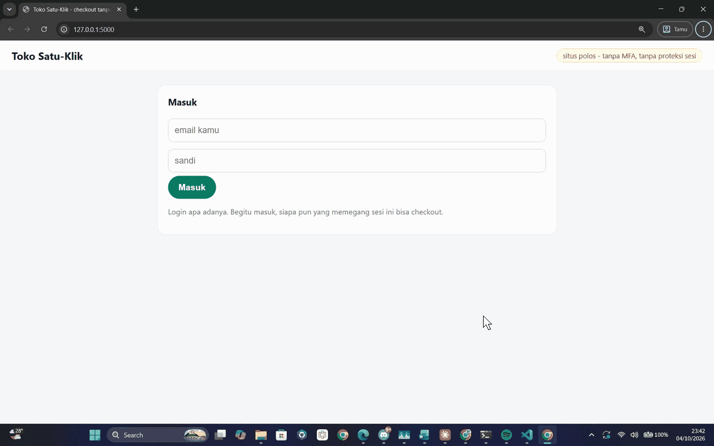

# Demo: colok BehaviorGuard ke toko yang cuma punya checkout

Satu situs **polos**: toko online beneran yang cuma punya **login + checkout**, punya
**backend sendiri**, dan **tidak punya MFA / proteksi sesi apa pun**. Lalu di depan penonton
kita colok BehaviorGuard: **1 baris di backend, 1 baris di halaman**. Kode login dan
checkout toko tidak disentuh.



Mau pasang di web kamu sendiri (Node, PHP, Laravel)? Lihat
[docs/PASANG-DI-WEB-KAMU.md](../../docs/PASANG-DI-WEB-KAMU.md).

## Isi folder

| File | Apa | Disentuh saat colok? |
|---|---|---|
| `shop.py` | Backend toko (Flask): login, checkout, daftar pesanan | 1 baris di bawah (hapus tanda `#`) |
| `index.html` | Halaman toko | 1 baris (hapus komentar di blok `COLOK`) |
| `bg_backend.py` | Bagian backend BehaviorGuard: route `/api/bg-token` dan `/api/bg-reauth` | tidak, cukup di-import |
| `plug-behaviorguard.js` | Bagian halaman: muat pustaka, badge, gerbang tombol, konfirmasi sandi | tidak, cukup dipanggil |

## Arsitektur

```
browser (tangkap mouse/ketik/scroll)
   |  34 angka fitur per 30 detik + vonis         (event mentah TIDAK dikirim)
   v
server BG :5055  --->  baseline lintas-perangkat + log  --->  dashboard operator
   ^
backend toko :5000  /api/bg-token   cetak token user yang login (pakai sk tenant)
                    /api/bg-reauth  cek ulang sandi (jalur verifikasi, toko ini belum punya MFA)
```
Catatan jujur untuk presentasi: **skor dihitung di browser**; server BG menyimpan fitur +
vonis untuk dashboard dan baseline lintas-perangkat.

## 0. Persiapan

```bash
pip install flask
```
Dua terminal:
```bash
python server/app.py                 # server BG + dashboard  -> http://127.0.0.1:5055
```
```bash
python demo/toko-checkout/shop.py    # toko                   -> http://127.0.0.1:5000
```

## Skrip video

### Babak 1 - situs polos (rapuh)
- Buka `http://127.0.0.1:5000`, login (login pertama = daftar), pilih barang, **Bayar** ->
  langsung berhasil.
- DevTools > Network: **tidak ada** `behaviorguard.js`. Tidak ada proteksi.
- Narasi: "Login sah. Tapi siapa pun yang memegang sesi ini bisa checkout."

### Babak 2 - colok (dua baris, di depan kamera)
1. **Backend** - `shop.py`, blok `COLOK BEHAVIORGUARD (bagian backend)`, hapus tanda `#`:
   ```python
   from bg_backend import pasang; pasang(app, current_user=lambda: session.get("user"), verify_password=cek_sandi)
   ```
   Restart `shop.py` (Ctrl+C, jalankan lagi).
2. **Halaman** - `index.html`, blok `COLOK BEHAVIORGUARD DI SINI`, hapus tag komentarnya
   supaya baris ini aktif:
   ```html
   <script src="plug-behaviorguard.js" defer></script>
   ```
3. Login lagi (restart mengosongkan data demo). **Badge muncul** di kiri bawah:
   "belajar pola pemilik ... mode: backend".

### Babak 3 - proteksi hidup
- **User baru (belum punya profil, toko belum punya MFA):** klik Bayar -> muncul
  **Konfirmasi sandi** -> sandi salah ditolak server -> sandi benar -> checkout lanjut.
- **Pemilik yang sudah dikenali** (pakai toko normal beberapa menit sampai badge **AMAN**):
  klik Bayar -> lolos tanpa gangguan.
- **Sesi dibajak:** orang lain memakai sesi itu ~30-60 detik -> badge **BAHAYA** -> Bayar
  -> diminta verifikasi -> penyerang tidak tahu sandinya -> **ditahan**.
- **Dashboard:** `http://127.0.0.1:5055/dashboard`, tempel `sk` dari
  `demo/toko-checkout/.bg-tenant.json`.

Selesai demo, kembalikan dua baris tadi ke keadaan dikomentari supaya demo berikutnya
mulai dari polos lagi.

## Kalau server BG (5055) tidak dijalankan
Plug tetap jalan **mode on-device**: BehaviorGuard melindungi dan verifikasi tetap bekerja,
cuma tanpa sinkron baseline dan tanpa dashboard. Badge tertulis "mode: on-device".
